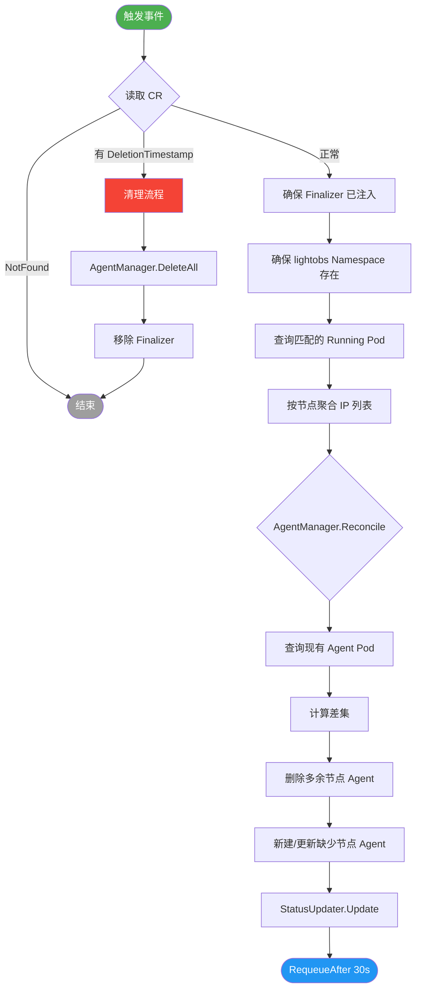
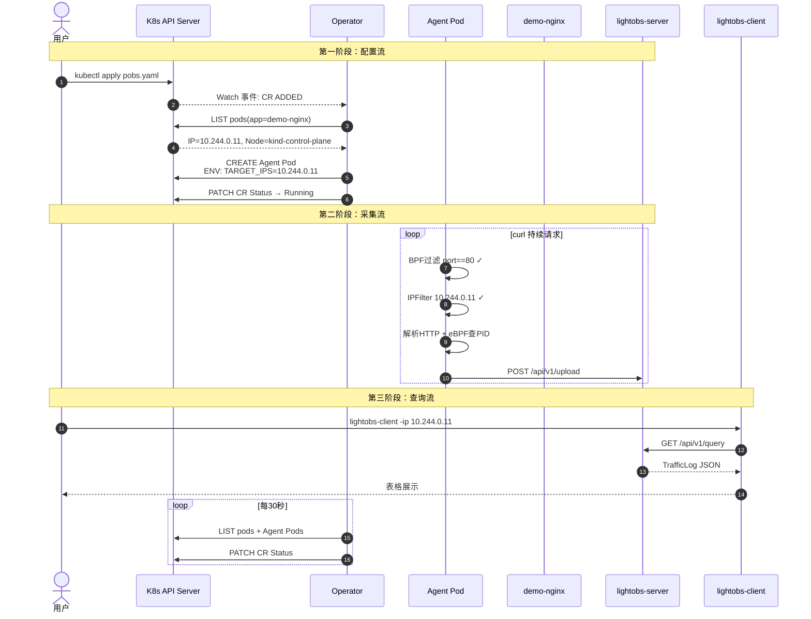

# LightObs V3 项目升级报告
## Kubernetes Operator 声明式采集管理功能

**报告日期**：2026-03-05  
**版本**：V3（在 V2 基础上新增 Operator 支持）  
**项目地址**：`/home/s117/Projects/LiteObs`  
**代码量**：2,783 行 Go（含新增 Operator 模块 1,045 行）

---

## 一、项目整体介绍

### 1.1 项目定位

**LightObs** 是一个**轻量级 Kubernetes HTTP 流量观测系统**，目标是在不修改业务代码、不引入 sidecar 的前提下，对集群内服务的 HTTP 通信进行实时抓包分析，提供请求路径、状态码、响应延迟和进程归属等信息，辅助开发者进行性能分析和故障排查。

### 1.2 整体架构

系统由三个核心组件构成，采用经典的 Agent-Server-Client 三层架构：

```
┌──────────────────────────────────────────────────────────────┐
│                    Kubernetes 集群                            │
│                                                              │
│  ┌──────────────────────────────────────────────────────┐   │
│  │  lightobs namespace                                   │   │
│  │                                                       │   │
│  │  ┌─────────────┐       ┌──────────────────────────┐  │   │
│  │  │  Agent Pod  │──────▶│  lightobs-server         │  │   │
│  │  │  (抓包采集)  │ HTTP  │  (SQLite / DuckDB 存储)  │  │   │
│  │  └─────────────┘       └──────────────────────────┘  │   │
│  │       ▲ 由 Operator 创建，注入采集配置                 │   │
│  │       │                                               │   │
│  │  ┌────┴──────────────────────────────┐               │   │
│  │  │  lightobs-operator                │               │   │
│  │  │  (Watch CR → 自动部署 Agent Pod)  │               │   │
│  │  └────────────────────────────────── ┘               │   │
│  └──────────────────────────────────────────────────────┘   │
│                                                              │
│  ┌──────────────┐         ┌─────────────────────────────┐   │
│  │  业务 Pod     │  HTTP  │  被 Agent 抓包，无需改代码   │   │
│  │  (demo-nginx) │◀──────▶│                             │   │
│  └──────────────┘         └─────────────────────────────┘   │
└──────────────────────────────────────────────────────────────┘

本地开发者
┌──────────────────┐
│  lightobs-client │──── GET /api/v1/query ────▶ lightobs-server
│  (CLI 查询工具)   │
└──────────────────┘
```

### 1.3 版本演进历史

| 版本 | 核心新增功能 | 关键技术 |
|------|------------|---------|
| **V1** | Agent 抓包 + Server 存储 + Client 查询 | AF_PACKET、DuckDB、HTTP REST |
| **V2** | eBPF 进程关联、SQLite 双存储、PID 查询 | Cilium/eBPF、BPF tracepoint、純Go eBPF |
| **V3** | **K8s Operator 声明式采集管理** | controller-runtime、CRD、Finalizer |

---

## 二、各组件功能说明

### 2.1 Agent（采集探针）

**位置**：`cmd/agent/` + `internal/agent/`  
**部署方式**：由 Operator 按需在目标节点上创建 Pod（V3 新增），或传统 DaemonSet 方式（向下兼容）

**核心能力**：
- 使用 **AF_PACKET + mmap（TPACKET_V3）** 在数据链路层零拷贝读取网络帧，性能远优于普通 pcap
- **两层过滤机制**（V3 增强）：
  - 第一层：内核态 **BPF 字节码**，只将目标端口的 TCP 包送入用户态，丢弃其他全部流量
  - 第二层：用户态 **IP 白名单**（`IPFilter`），精确匹配目标 Pod 的 IP，过滤非目标服务的同端口流量
- HTTP/1.x 协议解析（Best-Effort，无需 TCP 流重组）
- 通过 **eBPF tracepoint**（`inet_sock_set_state`）维护 `(SrcIP, DstIP, SrcPort, DstPort) → PID` 映射，实现流量与进程的关联

### 2.2 Server（数据存储与查询）

**位置**：`cmd/server/` + `internal/server/`  
**部署方式**：`lightobs` namespace 内的 Deployment（固定单副本）

**核心能力**：
- `POST /api/v1/upload`：接收 Agent 上报的 `TrafficLog` 结构体（JSON）
- `GET /api/v1/query`：支持按 IP、IP+Port 组合、PID 过滤查询历史流量
- 存储层通过接口抽象，支持 **DuckDB**（OLAP 分析优化）和 **SQLite**（纯 Go、无 CGO 依赖）双引擎切换

### 2.3 Client（命令行查询工具）

**位置**：`cmd/client/` + `internal/client/`  
**运行方式**：本地二进制

**核心能力**：通过命令行参数构建查询条件，以表格形式展示流量数据（含 PID 进程信息）

---

## 三、V3 新增功能：Kubernetes Operator

### 3.1 需求背景与问题

**V2 的部署痛点**：

原有方案使用 **DaemonSet** 将 Agent 部署到集群所有节点，存在三个根本问题：

```
问题 1：全局部署，无法精准
  Agent 在所有节点采集所有流量，无法只观测特定服务
  → 数据噪声大，采集资源浪费

问题 2：静态配置，无法动态响应
  目标服务扩缩容时，Agent 不感知 Pod IP 变化
  → 需要人工重新配置，运维负担重

问题 3：无生命周期管理
  没有自动化的 Agent 部署/清理机制
  → 服务下线后 Agent 仍在运行，资源泄漏
```

**V3 Operator 的解决思路**：

> 用 **声明式 API（CRD）** 描述"我想观测哪些 Pod"，让 **Operator** 自动感知 Pod 调度位置，按需在对应节点部署精准配置的 Agent，并全程管理其生命周期。

### 3.2 新增 CRD：PodObservation

**PodObservation** 是 V3 引入的自定义资源类型（Custom Resource Definition），是用户与系统交互的唯一接口。

**用户只需提交一个 YAML 声明意图**：

```yaml
apiVersion: lightobs.io/v1alpha1
kind: PodObservation
metadata:
  name: watch-demo-nginx
  namespace: demo
spec:
  selector:
    matchLabels:
      app: demo-nginx        # 观测打了这个标签的所有 Pod
  capture:
    port: 80                  # 只抓 80 端口的 HTTP 流量
    interface: "any"          # 监听所有网卡
    enableEBPF: true          # 开启 eBPF PID 关联
  reportTo:
    serverAddress: "lightobs-server.lightobs.svc.cluster.local:8080"
```

**Operator 自动回写运行时状态**（用户只读）：

```yaml
status:
  phase: Running
  observedNodes: 1
  targetPodCount: 1
  conditions:
    - type: AgentsReady
      status: "True"
      reason: AllAgentsRunning
      message: 所有 1 个目标节点的 Agent 均已就绪
      lastTransitionTime: "2026-03-05T02:27:18Z"
```

**CRD 设计要点**：
- **Spec/Status 分离**：通过 K8s `subresource: status` 机制隔离，用户只能修改 Spec，Operator 只能修改 Status，互不干扰
- **OpenAPI v3 Schema 校验**：`selector` 字段设为必填，端口范围限制 1-65535，`kubectl apply` 时 API Server 自动校验
- **additionalPrinterColumns**：`kubectl get pobs` 直接显示 Phase/Nodes/Pods 列，无需 `-o yaml`

### 3.3 Operator 架构设计

#### 模块组成

```
internal/operator/
├── api/v1alpha1/
│   ├── types.go              # CRD 的 Go 类型定义（Spec/Status/Phase/Condition）
│   ├── groupversion.go       # GVK 标识（lightobs.io / v1alpha1）
│   ├── register.go           # 向 runtime.Scheme 注册类型
│   └── zz_generated_deepcopy.go  # runtime.Object 接口实现（DeepCopyObject）
├── controller/
│   └── podobservation_controller.go  # 核心 Reconciler（决策层）
└── reconciler/
    ├── agent_manager.go      # Agent Pod 创建/删除/查询（执行层）
    └── status_updater.go     # CR Status 计算与回写（执行层）
```

#### 层次职责

| 层次 | 包 | 职责 | 类比 |
|------|-----|------|------|
| 决策层 | `controller` | **做什么**：Diff 计算、流程编排、Watch 路由 | 工程师 |
| 执行层 | `reconciler` | **怎么做**：实际的 K8s API 调用 | 工人 |
| 数据契约层 | `api/v1alpha1` | **是什么**：类型定义，无逻辑 | 设计图纸 |

### 3.4 核心 Reconcile 控制循环

Operator 的核心是一个永续运行的**检查-收敛**循环：



**触发源（三路 Watch）**：

```go
ctrl.NewControllerManagedBy(mgr).
    For(&api.PodObservation{}).               // ① CR 本身变化（用户操作）
    Watches(&corev1.Pod{}, podToObservation).  // ② 业务 Pod 扩缩容
    Watches(&corev1.Pod{}, agentToObservation).// ③ Agent Pod 意外消失（自愈）
    Complete(r)
```

### 3.5 精准流量过滤：两层设计

V3 的 Agent 在 Operator 模式下实现了两层协同过滤：

```
网卡接收到所有流量
        │
        ▼
┌───────────────────────────┐
│  Layer 1：内核态 BPF 过滤   │  ← 硬件级速度，零拷贝
│  规则：TCP port == 80      │
│  不匹配 → 直接在内核丢弃   │
└───────────────┬───────────┘
                │ 只有 TCP:80 的包才进入用户态
                ▼
┌───────────────────────────┐
│  Layer 2：用户态 IPFilter  │  ← O(1) 哈希查找
│  规则：IP ∈ {10.244.0.11} │  ← Operator 动态注入
│  不匹配 → continue 丢弃   │
└───────────────┬───────────┘
                │ 只有目标 Pod 的流量
                ▼
        HTTP 协议解析 & 上报
```

两层过滤的分工：
- **BPF（内核态）**：性能极高，但规则静态，只适合固定端口过滤
- **IPFilter（用户态）**：灵活，支持动态 IP 列表，Agent 启动时由 `LIGHTOBS_TARGET_IPS` 环境变量初始化

### 3.6 生命周期保障机制

#### Finalizer 防孤儿 Pod

```
用户 kubectl delete pobs watch-demo-nginx
              │
              ▼
K8s API Server：CR 上有 Finalizer "lightobs.io/agent-cleanup"
              │     → 不立即删除，只打 DeletionTimestamp 标记
              ▼
Operator 检测到 DeletionTimestamp != nil
              │
              ├─ AgentManager.DeleteAll()  删除所有关联 Agent Pod
              │
              └─ RemoveFinalizer()         移除 Finalizer
                         │
                         ▼
              K8s GC 真正删除 CR 对象
```

> **关键意义**：即使 Operator 在删除 CR 时恰好重启，K8s 也不会真正删除 CR（因为 Finalizer 还在），Operator 恢复后仍然能看到"待清理的 CR"，完成清理流程，彻底杜绝孤儿 Pod。

#### 跨 Namespace 场景的 GC 局限

本项目中，Agent Pod 运行在 `lightobs` Namespace，而 PodObservation CR 在用户业务 Namespace（如 `demo`）。K8s 原生的 OwnerReference GC 机制**不支持跨 Namespace**，因此 Finalizer 是防止孤儿 Pod 的**唯一可靠手段**，这也是 Finalizer 在本项目中被设为必要设计的根本原因。

#### 自愈机制

| 异常场景 | 检测方式 | 恢复速度 |
|----------|----------|----------|
| Agent Pod 被手动 delete | Watch 3（Agent Pod 变化）立即触发 | < 5 秒 |
| 节点重启导致 Pod 消失 | RequeueAfter 30s 周期检查 | ≤ 30 秒 |
| OOMKill / CrashLoop | kubelet 的 `restartPolicy: Always`（原生） | 秒级 |
| 目标 Pod 扩容到新节点 | Watch 2（业务 Pod 变化）立即触发 | < 5 秒 |

### 3.7 RBAC 权限设计（最小权限原则）

Operator 的 ClusterRole 严格按需授权：

```yaml
rules:
  - apiGroups: ["lightobs.io"]
    resources: ["podobservations", "podobservations/status", "podobservations/finalizers"]
    verbs: ["get", "list", "watch", "update", "patch"]

  - apiGroups: [""]
    resources: ["pods"]
    verbs: ["get", "list", "watch", "create", "delete"]  # 读业务Pod + 管理Agent Pod

  - apiGroups: [""]
    resources: ["namespaces"]
    verbs: ["get", "create"]

  - apiGroups: ["coordination.k8s.io"]
    resources: ["leases"]
    verbs: ["get", "create", "update", "patch"]  # Leader Election
```

**安全隔离**：Operator 本身以非 root 用户（UID 65532）运行，`readOnlyRootFilesystem: true`，与需要特权的 Agent Pod 形成安全隔离层。

---

## 四、项目目录结构（V3）

```
LiteObs/
├── cmd/
│   ├── agent/main.go         ★ 修改：新增 ENV 注入支持（Operator 模式）
│   ├── server/main.go        （未改动）
│   ├── client/main.go        （未改动）
│   └── operator/main.go      ★ 新增：Operator 启动入口
│
├── internal/
│   ├── agent/
│   │   ├── app/config.go     ★ 重建：新增 WatchPort、TargetIPs 字段
│   │   ├── app/app.go        ★ 重建：集成 IPFilter，支持精准采集
│   │   ├── filter/bpf.go     ★ 重建：TCPPortBPF(port) + IPFilter
│   │   ├── capture/          （未改动）
│   │   ├── httpmatcher/      （未改动）
│   │   ├── pidmap/           （未改动）
│   │   └── report/           （未改动）
│   │
│   ├── operator/             ★ 全新模块（1,045 行）
│   │   ├── api/v1alpha1/
│   │   │   ├── types.go              CRD Go 类型定义
│   │   │   ├── groupversion.go       GVK 标识
│   │   │   ├── register.go           Scheme 注册
│   │   │   └── zz_generated_deepcopy.go  DeepCopy 实现
│   │   ├── controller/
│   │   │   └── podobservation_controller.go  ★ 核心 Reconciler
│   │   └── reconciler/
│   │       ├── agent_manager.go      Agent Pod 生命周期管理
│   │       └── status_updater.go     CR Status 回写
│   │
│   ├── server/               （未改动）
│   └── client/               （未改动）
│
├── deploy/
│   ├── crds/
│   │   └── podobservation.yaml   ★ 新增：CRD 资源定义
│   ├── operator/
│   │   └── operator.yaml         ★ 新增：RBAC + Operator Deployment
│   └── k8s-lightobs.yaml         （未改动）
│
├── scripts/
│   ├── start.sh              （原有脚本，兼容旧 DaemonSet 模式）
│   └── start_with_operator.sh  ★ 新增：完整 Operator 演示脚本
│
└── go.mod                    ★ 新增依赖：controller-runtime v0.18.2
```

---

## 五、部署方式对比

| 对比维度 | V2（DaemonSet 模式） | V3（Operator 模式） |
|---------|---------------------|-------------------|
| 部署操作 | 手动 `kubectl apply -f daemonset.yaml` | `kubectl apply -f pobs.yaml`（声明意图即可） |
| 采集范围 | 所有节点的所有流量 | 精准匹配目标 Pod 的流量 |
| 扩缩容响应 | 手动重新配置 | Watch 事件触发，5 秒内自动响应 |
| IP 过滤 | 无（全量采集） | 两层过滤（BPF+IPFilter），只采集目标 Pod |
| Agent 清理 | 手动 `kubectl delete` | CR 删除时 Finalizer 自动清理 |
| 状态可观测性 | 无（纯黑盒部署） | CR Status 提供 Phase/Conditions/节点数 |
| 异常自愈 | 依赖 DaemonSet 自身重启 | 双 Watch + RequeueAfter 多层自愈 |
| 多任务隔离 | 不支持 | 可创建多个 CR，不同团队观测不同服务 |

---

## 六、真实运行验证数据

以下数据来自 **2026-03-05** 的本地 kind 集群实测。

### 6.1 集群运行状态

```
NAMESPACE   NAME                                               READY   AGE
lightobs    lightobs-operator-5784cdfcbd-rdmcp                 1/1     153m
lightobs    lightobs-server-6dbc5bdcf7-zqszk                   1/1     19h
lightobs    lightobs-agent-watch-demo-nginx-kind-control-plane  1/1     3h31m

demo        demo-nginx-68899b65f4-5ck7x   1/1   19h   IP: 10.244.0.11
demo        demo-curl                     1/1   153m  （持续发送 HTTP 请求）
```

### 6.2 PodObservation CR 状态

```yaml
# kubectl -n demo describe pobs watch-demo-nginx
Status:
  Phase:           Running          ← Operator 确认所有 Agent 就绪
  Observed Nodes:  1                ← 1 个节点上有 Agent 在运行
  Target Pod Count: 1               ← 匹配到 1 个 Running 的 demo-nginx Pod
  Conditions:
    Type:    AgentsReady
    Status:  True
    Reason:  AllAgentsRunning
    Message: 所有 1 个目标节点的 Agent 均已就绪
```

### 6.3 Agent 精准注入验证

```
# kubectl -n lightobs logs lightobs-agent-watch-demo-nginx-kind-control-plane
2026/03/05 02:27:18 IP 白名单过滤已启用，目标 IP：[10.244.0.11]
2026/03/05 02:27:18 开始抓包：iface=any port=80 -> server=lightobs-server...:8080
```

> IP `10.244.0.11` 是 demo-nginx Pod 的真实 IP，由 Operator 从 K8s API 查询后通过 `LIGHTOBS_TARGET_IPS` 环境变量注入到 Agent，**精准无误**。

### 6.4 Operator 自检心跳日志

```
2026-03-05T03:13:19Z  INFO  目标节点计算完成  {"targetPods": 1, "targetNodes": 1}
2026-03-05T03:13:49Z  INFO  目标节点计算完成  {"targetPods": 1, "targetNodes": 1}
...（每 30 秒一条，系统持续自监控）
```

### 6.5 端到端采集数据（Client 查询结果节选）

```
+-----------------------------+--------+-------------------+----------------+--------+------+--------+
| Timestamp                   |  PID   |       Src         |    Dst         | Method | Path | Status |
+-----------------------------+--------+-------------------+----------------+--------+------+--------+
| 2026-03-05T02:47:34.464938Z | 213918 | 10.244.0.35:46662 | 10.244.0.11:80 | GET    | /    |    200 |
| 2026-03-05T02:47:34.290317Z | 213914 | 10.244.0.35:46652 | 10.244.0.11:80 | GET    | /    |    200 |
| 2026-03-05T02:47:34.079005Z | 213910 | 10.244.0.35:46642 | 10.244.0.11:80 | GET    | /    |    200 |
+-----------------------------+--------+-------------------+----------------+--------+------+--------+
```

**数据字段说明**：
- **PID**（213918 等）：eBPF 关联到的进程 ID，非零表示 eBPF 进程追踪正常工作
- **Dst = 10.244.0.11:80**：命中目标 Pod，IP 白名单过滤精准生效
- **Status = 200**：HTTP 响应码，完整的请求-响应配对解析成功

---

## 七、数据流转时序



---

## 八、技术选型说明

| 组件 | 技术选型 | 选型理由 |
|------|---------|---------|
| Operator 框架 | `sigs.k8s.io/controller-runtime v0.18.2` | 轻量，无需 kubebuilder CLI，与项目轻量定位一致 |
| CRD 类型生成 | 手写 + `zz_generated_deepcopy.go` | 无需引入 controller-gen，保持依赖链简洁 |
| Agent 配置注入 | 环境变量（Pod ENV） | 简单直接；IP 变化时选择重建 Pod 而非热更新 |
| Agent 部署方式 | 裸 Pod（非 DaemonSet） | 按需部署，只在有目标 Pod 的节点创建，资源利用率更高 |
| 孤儿 Pod 防护 | Finalizer（主）+ OwnerReference（辅） | 跨 Namespace 场景 GC 失效，Finalizer 是唯一可靠手段 |
| 流量过滤 | BPF 内核态 + IPFilter 用户态 | 性能（内核丢包）与灵活性（动态 IP）的最优平衡 |

---

## 九、Operator 核心代码规模

| 文件 | 行数 | 说明 |
|------|------|------|
| `reconciler/agent_manager.go` | 325 | Agent Pod 完整生命周期管理 |
| `controller/podobservation_controller.go` | 283 | 核心 Reconcile 逻辑 + 三路 Watch |
| `api/v1alpha1/types.go` | 112 | CRD 数据类型定义 |
| `reconciler/status_updater.go` | 112 | CR Status 计算与回写 |
| `api/v1alpha1/zz_generated_deepcopy.go` | 86 | DeepCopy 接口实现 |
| `cmd/operator/main.go` | 92 | 启动入口 + Manager 配置 |
| `api/v1alpha1/register.go` + `groupversion.go` | 35 | Scheme 注册 |
| **Operator 模块合计** | **1,045** | 占全项目 2,783 行的 **37.5%** |

---

> **结语**：LightObs V3 通过引入 Kubernetes Operator 和 CRD，将流量观测能力从"手动部署、全局采集"升级为"声明式、精准、自动化"的云原生管理模式。用户只需一个 YAML 文件声明观测意图，系统自动完成 Agent 的部署、配置、自愈和清理全流程，大幅降低了使用门槛和运维成本。
